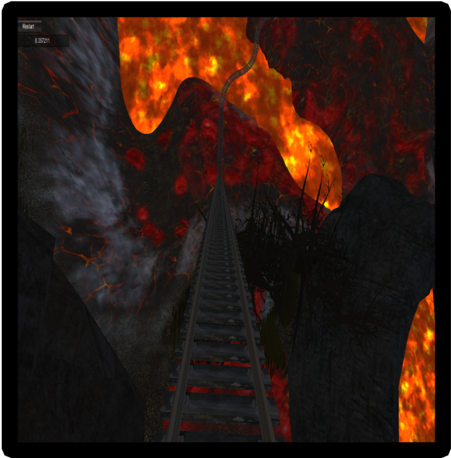

# Invitation to death 4D VR Game
> 게임 'ITD'입니다. 스타트업과 산학협력으로 개발했으며 VR+Motion device가 있어야 정상적인 구동이 가능합니다. (전체 프로젝트 파일은 용량이 너무 커 올리지 않았습니다. 전체 프로젝트 파일을 원하시는 분은 하단 정보 카테고리에 있는 메일 주소로 메일을 보내주시기 바랍니다.)

[![NPM Version][npm-image]][npm-url]
[![Build Status][travis-image]][travis-url]
[![Downloads Stats][npm-downloads]][npm-url]

"죽은 여자친구를 되찾기 위해 지옥으로!"

탄광 열차를 타고 레일을 따라 움직이며 미션을 수행

약 1.5km의 레일 코스를 약 3분의 플레이 타임을 가지고 진행합니다.

## 게임 소개

오큘러스 리프트를 이용한 다양한 가상현실 체험게임들이 나오고 있고, 여러 4D 체험 게임들 또한 나오고 있지만 이 둘을 합친 게임은 적었습니다. 저희는 지난 1년 조원들과 모션디바이스사와의 협업을 통하여 모션디바이스의 익사이팅한 체감효과 와 오큘러스 리프트의 가상현실 구현을 접목한  3D 체험형 가상현실 게임을 개발 하였다.

# 게임 플레이 화면

## 설치 방법

OS X & 윈도우:

1. Git 파일을 내려받습니다.

2. Unity3d Project 열기로 해당 폴더 열기

## 업데이트 내역

* 0.1.0
    * version 0.1.0 작업 완료 (2015.10)
* 0.0.1
    * 작업 진행 중

## 정보

장성우 – [@facebook](https://www.facebook.com/profile.php?id=100007028118707&ref=bookmarks) – seongwoo.dev@gmail.com

MIT 라이센스를 준수하며 ``LICENSE``에서 자세한 정보를 확인할 수 있습니다.

[https://github.com/jangseongwoo/github-link](https://github.com/jangseongwoo/github-link)

<!-- Markdown link & img dfn's -->
[npm-image]: https://img.shields.io/npm/v/datadog-metrics.svg?style=flat-square
[npm-url]: https://npmjs.org/package/datadog-metrics
[npm-downloads]: https://img.shields.io/npm/dm/datadog-metrics.svg?style=flat-square
[travis-image]: https://img.shields.io/travis/dbader/node-datadog-metrics/master.svg?style=flat-square
[travis-url]: https://travis-ci.org/dbader/node-datadog-metrics
[wiki]: https://github.com/yourname/yourproject/wiki
