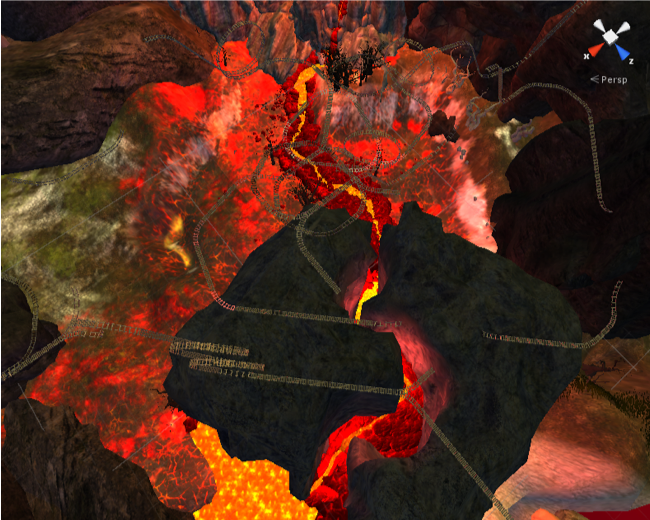
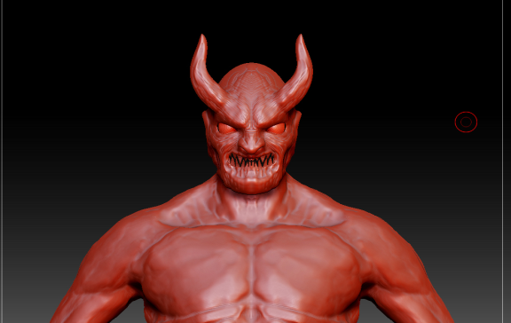
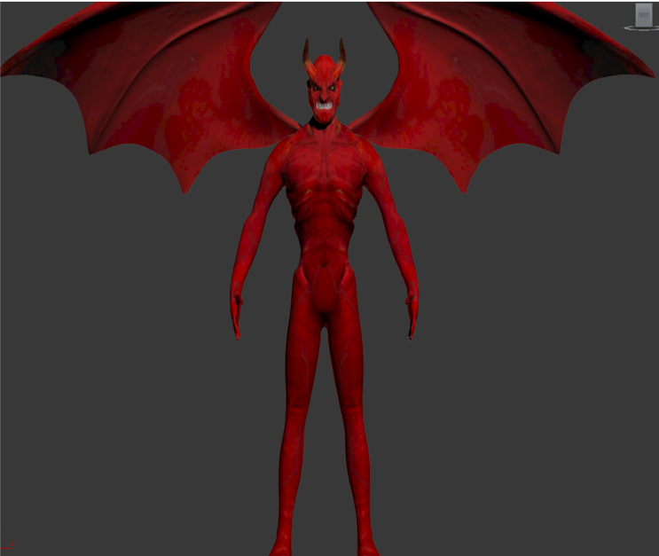
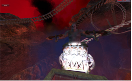
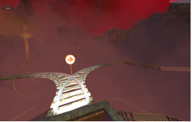
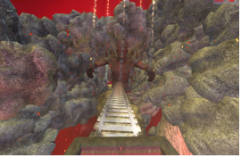

# Invitation to death - 4D VR Game
> 프로젝트 'ITD'입니다. (주)모션디바이스와 산학협력으로 개발했으며 VR+Motion device가 있어야 정상적인 구동이 가능합니다. 
(전체 프로젝트 파일은 용량이 너무 커 올리지 않았습니다. 전체 프로젝트 파일을 원하시는 분은 하단 정보 카테고리에 있는 메일 주소로 메일을 보내주시기 바랍니다.) 

"죽은 여자친구를 되찾기 위해 지옥으로!"

탄광 열차를 타고 레일을 따라 움직이며 미션을 수행

약 1.5km의 레일 코스를 약 3분의 플레이 타임을 가지고 진행합니다. 

## 게임 소개

### 게임 플레이 화면

- 시작 후 1인칭, 3인칭 화면

- 전체 맵 

- devil - monster modeling image

- 게임 내 mission 최종보스 / 길막몹 / 갈림길 선택

- 실제 플레이 모습(VR과 Motion device 탑승 상태)

- 실제 플레이 영상(개발 50% 완료 플레이 영상, VR 미착용)
<iframe width="300" height="260" src="https://www.youtube.com/embed/gUbah-mU-zY?list=PL5hRdzUugwbRL76tTvyy7_AiprT0y24VE" frameborder="0" allow="autoplay; encrypted-media" allowfullscreen></iframe>

## 설치 방법

OS X & 윈도우:

1. Git clone  - https://github.com/jangseongwoo/VR-Game---Invitation-to-death.git

2. Unity3d Project로 Invitation to death 폴더 열기

## 개발 목표 및 내용

- Unity3D의 물리엔진을 이용하여 현실감 넘치는 객차의 움직임을 구현

- ‘Oculus VR’, UDP 통신을 통한 ‘Motion Device’와의 연동을 통해 게임의 4자유도를 구현해 현실감을 증폭

- 3D-MAX, Z-brush를 이용한 3D모델링 제작

- ‘Motion Device’ 기업과의 연계를 통한 게임 개발 경험

## 사용 기술

- Unity3d, Visual Studio, C#, Oculus Lift, Motion device, 3D max, Photoshop, Zbush

## 게임의 장점

이 게임의 장점으로는 실감 나면서도 안전한 체험에 있습니다. 현실에선 불가능한 위험한 레일을 모션디바이스와 오큘러스 리프트의 장비효과를 살려 마음껏 즐길 수 있습니다.
여타 3D 체험관의 시뮬레이션들보다 사실감 넘치는 가상현실 체험과 상호작용이 가능합니다.

## 추가 개발 및 개선 요구사항

완성된 트랙이 하나 뿐 이기에 여러 번 게임을 즐기기에 부족한 부분이 있습니다. 이를 개선하기 위하여 추가적으로 트랙과 맵을 제작해야 할 필요가 있습니다.
Oculus DK2는 아직 미완성 제품으로 인지와 게임 화면 전환의 차이로 인한 멀미 현상이 있으며 모션디바이스 탑승으로 인한 멀미가 발생 할 수 있어, 장시간 게임을 즐기기에 무리가 따를 수 있습니다.

## 업데이트 내역

* 1.0.0
* version 1.0.0 작업 완료 (2015.10)
* 0.0.1
* 작업 진행 중

## 최소 시스템 요구 사항
- 시스템 운영체제:Windows XP
- CPU 프로세서:Intel Core i3-4005U
- 램:4GB 
- 그래픽카드: AMD Radeon 6630M 
- 하드 드라이브 필요 용량: 1GB이상의 여유공간

## 정보

장성우 – [@facebook](https://www.facebook.com/profile.php?id=100007028118707&ref=bookmarks) – seongwoo.dev@gmail.com

MIT 라이센스를 준수하며 ``LICENSE``에서 자세한 정보를 확인할 수 있습니다.

[https://github.com/jangseongwoo/github-link](https://github.com/jangseongwoo/github-link)

<!-- Markdown link & img dfn's -->
[npm-image]: https://img.shields.io/npm/v/datadog-metrics.svg?style=flat-square
[npm-url]: https://npmjs.org/package/datadog-metrics
[npm-downloads]: https://img.shields.io/npm/dm/datadog-metrics.svg?style=flat-square
[travis-image]: https://img.shields.io/travis/dbader/node-datadog-metrics/master.svg?style=flat-square
[travis-url]: https://travis-ci.org/dbader/node-datadog-metrics
[wiki]: https://github.com/yourname/yourproject/wiki
